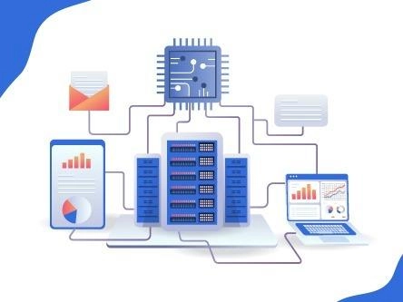
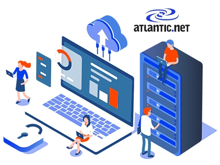
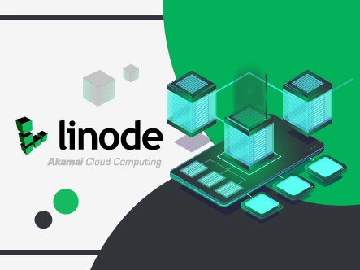
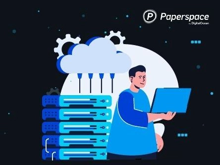
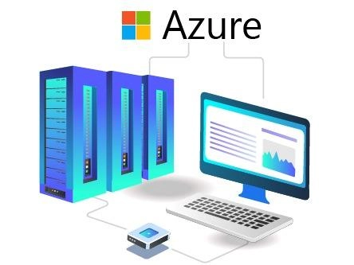
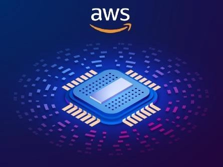

# 2025年最值得选择的8家GPU服务器托管商——AI和机器学习的理想选择

---

作为开发者，你是否常常为处理机器学习和AI相关的复杂计算任务而头疼？如果答案是肯定的，那么选择一家提供高性能NVIDIA驱动GPU服务器的优质托管商，可能就是你当前最需要的解决方案。

这篇文章会带你了解2025年市场上表现最出色的8家GPU服务器托管商，告诉你在选择AI/ML用途的GPU服务器时应该关注哪些要点，以及这些服务商如何通过可靠的技术支持来保障你的应用数据安全。

---

## GPU服务器托管到底是什么？

简单来说，GPU服务器托管就是一种"租用显卡算力"的服务。托管商会提供配备了图形处理单元（GPU）的专用服务器，专门用来处理那些对计算能力要求极高的任务——比如人工智能模型训练、机器学习算法运行，以及深度学习项目开发。

这些服务器通常搭载业界领先的NVIDIA GPU，能够为你的项目提供强大的并行计算能力。无论是训练神经网络、处理大规模数据集，还是进行实时图像识别，GPU服务器都能显著提升处理速度和效率。

如果你正在寻找一个能够支撑高强度计算需求、同时又稳定可靠的云基础设施，不妨了解一下 👉 [Vultr提供的全球化GPU云服务方案，部署快速且性价比突出](https://www.vultr.com/?ref=9738262-9J)。这类服务通常按需计费，让你在控制成本的同时获得企业级的计算资源。

接下来，让我们逐一看看2025年最值得信赖的GPU服务器托管商都有哪些。

---

## 1. InterServer – 综合实力最强的裸金属GPU服务器方案

InterServer是业内知名的GPU服务器托管商之一，专门提供基于裸金属架构、搭载最新NVIDIA显卡的高性能服务器。这些服务器在数据处理和加速运算方面经过深度优化，非常适合需要大量算力的AI和机器学习项目。

用户可以根据实际需求选择单卡或双卡GPU配置，还能灵活调整服务器的其他硬件参数。更重要的是，InterServer的GPU服务器部署在新泽西和西雅图的数据中心，配备了先进的冷却系统、冗余电源以及多层安全防护措施，确保数据安全无忧。

**核心优势：**

🔶 **全天候技术支持**：通过在线客服和工单系统，随时解决服务器配置相关的技术问题。

🔶 **可靠的硬件基础**：采用NVIDIA最新技术，保证数据处理速度快、服务器性能稳定。

🔶 **高度可扩展**：支持最多4张GPU卡的配置，并且可以根据需要随时增加更多显卡。

🔶 **完全自定义权限**：提供完整的root访问权限，用户可以根据项目需求自由配置和调整服务器。

---

## 2. Atlantic.Net – 专业的GPU云服务提供商

Atlantic.Net是一家专注于高性能计算的云服务商，特别擅长为AI、机器学习和其他计算密集型应用提供GPU解决方案。

他们的服务包括灵活的GPU云托管（适合动态工作负载）、配备最新NVIDIA GPU的高性能专用服务器，以及专为医疗保健应用设计的HIPAA合规GPU托管方案。

Atlantic.Net使用来自Supermicro和Dell的顶级硬件，配合SSD和NVMe存储，提供快速高效的数据处理能力。再加上超高带宽的网络连接，无论哪种服务都能保证低延迟和高速运行。

**核心优势：**

🔶 **尖端硬件配置**：使用NVIDIA H100 NVL和L40S等强大GPU，提供复杂AI和机器学习任务所需的计算能力。

🔶 **安全合规的基础设施**：数据中心符合HIPAA/HITECH、PCI DSS、SOC 2/3和GDPR等重要合规标准，为敏感信息提供全方位保护。

🔶 **100%正常运行时间SLA**：承诺云平台的可靠性和稳定性，确保应用程序持续可用。

🔶 **快速部署**：支持在60秒内完成GPU实例部署，快速响应各种工作负载需求。

---

## 3. Linode – 灵活可靠的云端GPU服务器

Linode（现已成为Akamai的一部分）专门为媒体处理和游戏场景提供虚拟机和GPU服务器，能够有效支持高强度的计算任务和机器学习项目。

他们的服务器搭载业界领先的NVIDIA GPU，能够轻松应对复杂的数据处理、深度学习训练以及媒体工作负载。作为优秀的GPU服务器提供商，Linode还提供先进的DDoS防护和快速的GPU部署服务，保证工作流程顺畅无阻。

**核心优势：**

🔶 **高度可扩展的方案**：Linode的GPU方案支持灵活调整，用户可以根据需要轻松增加或减少GPU资源。

🔶 **完整的root权限**：对GPU服务器拥有完全访问权限，方便根据应用需求进行定制和优化。

🔶 **可靠的硬件支持**：提供基于NVIDIA的GPU服务器，配备流畅的CPU和不限流量的网络连接。

🔶 **强大的安全防护**：提供先进的DDoS防护，保护服务器免受恶意攻击。

**价格方案：**

| RTX6000 GPU X1 ($1000/月) | RTX6000 GPU X2 ($2000/月) | RTX6000 GPU X3 ($3000/月) |
|--------------------------|--------------------------|--------------------------|
| 32GB内存 + 8核CPU | 64GB内存 + 16核CPU | 96GB内存 + 20核CPU |
| 16TB带宽 + 1块GPU | 20TB带宽 + 2块GPU | 120TB带宽 + 3块GPU |
| 按小时计费 - $1.5 | 按小时计费 - $3 | 按小时计费 - $4.5 |

---

## 4. Vultr – 性价比出众的云GPU服务器

Vultr是一家提供行业领先GPU基础设施的NVIDIA GPU服务器供应商，专注于AI、机器学习和高性能计算领域。

开发者可以使用Vultr搭建基于GPU的Kubernetes集群，或者开发先进的AI和机器学习系统来处理复杂任务。GPU资源与集成操作系统和云计算服务无缝协作，确保解决方案顺畅运行。

从世界级的GPU服务器到对DevOps友好的内置功能，Vultr提供了帮助你实现业务各个方面所需的一切。如果你正在寻找一个部署简单、全球覆盖广、且成本可控的GPU云平台，👉 [Vultr的灵活定价和强大性能值得一试](https://www.vultr.com/?ref=9738262-9J)，特别适合中小型项目和初创团队快速上手。

**核心优势：**

🔶 **全球内容分发**：通过不限流量的高速网络和全天候访问，确保内容快速安全地交付。

🔶 **强大的DDoS防护**：提供针对第3层和第4层网络攻击的反DDoS安全防护，保障数据免受在线威胁。

🔶 **创建专属IP空间**：可以在Vultr全球任何数据中心位置轻松构建可用的IP地址空间。

🔶 **完全可扩展的方案**：允许用户根据需要无缝升级或降级GPU资源。

---

## 5. Paperspace（现属于DigitalOcean）– 专为机器学习优化的云GPU

Paperspace是最实惠且优秀的GPU服务器托管商之一，专门为机器学习场景设计了云端GPU服务器。

用户可以获得预装了机器学习框架和出色CUDA驱动的高速GPU服务器。开发者可以使用SSH密钥直接连接服务器，确保对GPU服务器的完全root访问。

此外，Paperspace提供包括Ampere A100在内的最新NVIDIA GPU选择。配合易用的界面和可定制的GPU方案，带来优质的用户体验。

**核心优势：**

🔶 **简单的管理界面**：提供易于使用的界面来管理GPU服务器，无需专业技术技能。

🔶 **按小时计费**：采用可预测的按小时计费模式，用户只需为特定时间段购买资源。

🔶 **完整的root访问**：获得GPU服务器的完全root访问权限，可以按需进行配置。

🔶 **最低1Gbps网络连接**：享受闪电般快速的网络连接，确保最大正常运行时间。

---

## 6. Google Cloud – 适合高强度工作负载的GPU方案

如果你需要用于科学计算、机器学习、生成式AI和3D可视化的云服务器，Google Cloud的GPU工作负载部署服务值得考虑。它提供访问行业领先的存储、网络和数据分析技术的机会。

Google的Compute Engine服务提供可添加到服务器的GPU资源。此外，Google Cloud还提供灵活的定价和服务器定制选项，以优化你的工作负载。新用户还可以获得免费试用服务，在接下来的90天内获得$300信用额度。

**核心优势：**

🔶 **90天免费GPU试用**：为想要体验优质用户体验的新用户提供免费GPU试用。

🔶 **提供多种GPU类型**：从NVIDIA H100到A100，Google Cloud提供多种GPU选项来处理工作负载。

🔶 **灵活的性能**：为个人工作负载和复杂任务提供灵活的GPU服务器性能。

🔶 **易于扩展**：可以无缝升级或降级GPU资源，以匹配应用工作负载的性能需求。

---

## 7. Azure – AMD驱动的高性价比GPU服务器

Azure的NVIDIA GPU服务器帮助开发者提升机器学习、深度学习和HPC应用的性能。Azure的GPU服务器预装了UbuntuOS、GPU驱动、Docker和NVIDIA容器。

作为顶级GPU服务器提供商之一，Azure凭借其出色的DDoS防护和快速GPU部署确保无缝运营。Azure还提供包括A10在内的最新NVIDIA GPU选择，配合可定制的GPU方案和直观界面，提供优质的用户体验。

**核心优势：**

🔶 **NVIDIA AI专家支持**：通过NVIDIA AI支持服务获得全天候专业帮助。

🔶 **完全可扩展的方案**：允许用户根据需要轻松增加或减少GPU资源。

🔶 **完整的root访问**：获得GPU服务器的完全root访问权限，可以按需配置。

🔶 **出色的安全性**：提供先进的DDoS防护，保护服务器免受恶意攻击。

---

## 8. AWS和NVIDIA – 强大的云GPU服务器托管

AWS支持的NVIDIA A100 Tensor Core GPU服务器是高性能GPU服务器提供商之一，能够执行工程仿真、分子建模和机器学习任务。

简而言之，在具有高网络性能和快速存储的GPU服务器上运行你的高性能计算应用程序。此外，GPU云计算服务运行良好并提供可靠的解决方案。凭借顶级GPU服务器和对DevOps友好的内置工具，AWS拥有管理公司各个方面所需的一切。

**核心优势：**

🔶 **集成可靠的硬件**：NVIDIA技术支持AWS的GPU服务器，确保快速数据处理并提升服务器性能。

🔶 **自定义配置（完整root访问）**：对GPU服务器拥有完全控制权，可以添加GPU卡或进行其他修改。

🔶 **出色的安全性**：提供反DDoS防护，保护服务器免受敌对攻击。

🔶 **提供各种GPU类型**：从NVIDIA H100到A100，AWS提供广泛的GPU选择。

---

## 选择AI和机器学习GPU服务器时应该考虑什么？

在为AI和机器学习选择GPU服务器主机时，请记住以下几个关键因素：

- **GPU型号和性能**：确认提供的GPU是否满足你的计算需求
- **可扩展性**：能否根据项目发展灵活调整资源
- **网络速度**：数据传输速度是否足够快
- **安全防护**：是否有完善的DDoS防护和数据加密措施
- **技术支持**：是否提供及时的技术援助和问题解决服务
- **价格透明度**：计费方式是否清晰，有无隐藏费用

这些因素对于选择合适的GPU服务器来处理应用工作负载至关重要。

---

## 总结

上面介绍的这8家GPU服务器托管商，都提供了先进的DDoS防护、可靠的GPU硬件以及全球分布的数据中心，能够有效保护应用数据安全、处理复杂工作负载并提升服务器性能。

如果你是需要GPU服务器来处理关键应用工作负载的开发者或游戏玩家，可以从上述GPU服务器托管商中选择适合自己的方案。

还在犹豫选哪家？那就试试InterServer（获得性价比最高的NVIDIA GPU服务器）或者Google Cloud（享受90天GPU免费试用），具体取决于你的实际需求和预算。
